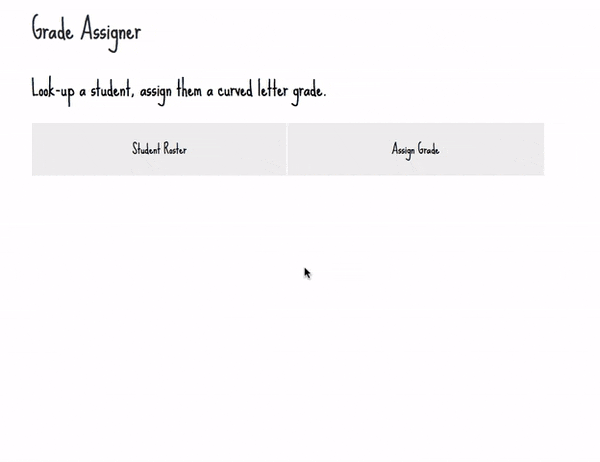

# Homework 5 - Grade Assigner

Create a Grade Assignment app that will allow you to view your student roster, and assign a curved letter grade to each student.



### Step 1 - Fork this repository.

From the assignment homepage (https://github.com/fewd90nyc/fewd90week5), click the "Fork" link on the top right. This will create a copy of the assignment in YOUR github account.

### Step 2 - Clone your forked repository.

From the repository homepage (which will be http://github.com/YOURUSERNAME/fewd90week5), click on green "Clone or Download" button and "Open in Desktop". This should open your Github Desktop App and prompt you to save the fewd90week5 folder on your computer.

### Step 3 - Build!

Hide and show `div.roster` and `div.assign` when the user clicks on `#roster` and `#assign`. Turn the class `.selected` on and off on the `#roster` and `#assign` as appropriate.

Create an onclick event for `#clickme` that gets the value of `#name` and `#grade`.

- Decide on what grade thresholds determine what letter grade (what the "curve" is).
- Perform a series of checks to determine the persons letter grade (think Age Privilege exercise).
- Add a `<li>` to the `#reportcard` `<ul>` by adding to it's `innerHTML` property.
- This will look similar to:

```javascript
someList.innerHTML = someList.innerHTML + "<li>New Item</li>";
```

### Step 4 - Commit and Sync

Work on your website locally and view it in the browser by opening your index.html file. When your site looks good, Commit and Sync with the Github App.

### Step 5 - Pull Request

Send a Pull Request to submit your homework. From your fewd90week5 page on github.com (https://github.com/YOURUSERNAME/fewd90week5), click on the "New Pull Request" button and follow the prompts. 

### Step 6 - Publish with [Gitbot](http://gitbot.co/)! (optional)

Want to post your fewd90week5 project on your github.io url? Log into gitbot and click the fewd90week5 repository button and VOILA! It will (perhaps after a few minutes) be viewable online at http://YOURUSERNAME.github.io/fewd90week5

